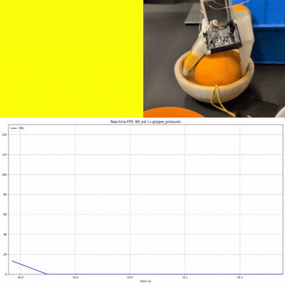

# LePotager 🍊

**A robotic arm that picks fruit, judges its ripeness by touch, and sorts it.**


<p align="center">
  
</p>

🏆 **Most Creative Project** : built in 48 hours at the Hugging Face *LeRobot Mini-Factory* hackathon.

## The problem

A camera can spot a fruit on the table, but it can't tell whether it's ripe or hard as a rock. That takes **touch**. LePotager puts a piezoresistive Velostat pad on the gripper and fuses that pressure signal with vision inside an **ACT imitation-learning policy**, so the robot feels what it's holding instead of just seeing it.

## How it works

Each cycle chains three steps:

1. **Pick** : an ACT policy grasps the orange, using the front + RealSense cameras *and* the gripper's tactile state.
2. **Sense** : three squeeze cycles measure firmness, the peak pressure decides **ripe** or **reject**.
3. **Sort** : a recorded trajectory drops the fruit in the matching bin.

<p align="center">
  
  <br/>
  <i>The gripper probing firmness — the pressure signal spikes on contact.</i>
</p>

## What we learned

To make the policy robust, we recorded *error-recovery* demos to aim beside the fruit, then correct and grab it. But we over-sampled them.

In testing, the robot started aiming **beside** the fruit first, every single time, before correcting to grab it. It had perfectly learned our recovery move but as a mandatory step of the motion.

The cause is purely statistical because we generated so many recovery trajectories that, instead of staying edge cases, they dominated the dataset distribution. Imitation learning faithfully reproduced what we *showed* it, not what we *meant*. Had those corrections stayed a minority, it would have worked as intended.

<p align="center">
  
  <br/>
  <i>The policy aiming beside the fruit on purpose </i>
</p>

## Tech stack

- **[LeRobot](https://github.com/huggingface/lerobot)** : SO-101 arm, dataset recording, ACT policy
- **`so101_tactile_follower`** : custom plugin extending `observation.state` to 7 dims with `gripper_pressure`
- **ESP32 + Velostat pad** : gripper pressure at ~700 Hz, dual-EMA bandpass filtered
- **Intel RealSense + USB camera** : vision
- **Python 3.12**

## What's in this repo

LePotager is a thin **application layer** (~10 clean Python files) on top of LeRobot. The `lerobot/` folder is the full Hugging Face library. The project itself is the tactile plugin, the Velostat reader, the palpation protocol, and the pipeline that orchestrates the three steps.

<details>
<summary><b>Architecture, setup &amp; run</b></summary>

### Repo structure

```
├── configs/pipeline.example.yaml   # copy → pipeline.yaml
├── scripts/
│   ├── run_pipeline.py             # alias for `lepotager`
│   └── record_tactile_dataset.sh
├── src/lepotager/
│   ├── pipeline.py                 # orchestrator (subprocess chain)
│   ├── palpation.py                # firmness probe
│   └── hardware/                   # LeRobot robot plugin + Velostat reader
├── tests/test_velostat_fpb.py
└── lerobot/                        # git submodule @ 906b585
```

### Requirements

Runs only with the physical setup: a calibrated **SO-101** arm, an **ESP32 + Velostat** pressure sensor, calibrated cameras, a trained **ACT checkpoint**, and route-replay datasets.

### Setup

```bash
git submodule update --init --recursive

conda activate lerobot
pip install -e .
pip install -e "./lerobot[feetech,pyserial-dep]"

cp configs/pipeline.example.yaml configs/pipeline.yaml
# edit configs/pipeline.yaml — robot port, cameras, route datasets
```

If `lerobot-rollout` isn't on your PATH after activating the env:

```bash
export LEROBOT_BIN_DIR=<path-to-your-conda-env>/bin
```

### Run

```bash
lepotager
# or: python scripts/run_pipeline.py
```

Override ports without editing the config:

```bash
LEPOTAGER_ROBOT_PORT=/dev/serial/by-id/... \
LEPOTAGER_ESP32_PORT=/dev/ttyUSB0 \
lepotager
```

Record new demonstrations: [docs/recording.md](docs/recording.md) · Sensor bring-up: [docs/hardware.md](docs/hardware.md).

</details>

## Credits

Built with my teammates **Jose Vasquez**, **Doga Ozbek**, and **Hakan Yanık**

## License

MIT — see [LICENSE](LICENSE).
