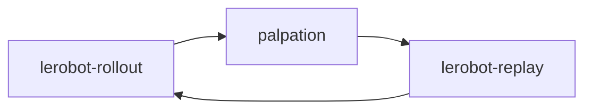

# LePotager🍊

Robotic arm that picks fruit, probes ripeness by touch, and sorts it into bowls.

Built in 48 hours at the Hugging Face LeRobot Mini-Factory hackathon — **Most Creative Project**.

## Problem

A camera identifies fruit on the table. It cannot measure ripeness — that requires **touch**. LePotager adds a piezoresistive Velostat pad on the gripper and fuses the pressure signal with vision inside an ACT imitation-learning policy.

## Pipeline

Each cycle chains three LeRobot CLI subprocesses:

1. **`lerobot-rollout`** — ACT policy picks the orange (front + RealSense + tactile state)
2. **`lepotager.palpation`** — three gripper squeeze cycles; peak FPB pressure → RIPE / REJECT
3. **`lerobot-replay`** — recorded teleop trajectory routes the fruit to the correct bin



## What we learned

We recorded error-recovery demos: aim beside the fruit, then correct. We over-sampled them. The policy learned to aim **beside** the fruit first — imitation learning reproduced the demonstration distribution, not the intent we thought we were teaching.

## Stack

- [LeRobot](https://github.com/huggingface/lerobot) — SO-101, dataset recording, ACT
- Custom `so101_tactile_follower` — extends `observation.state` to 7 dims (`gripper_pressure`)
- ESP32 + Velostat — gripper pressure at ~700 Hz
- Python 3.12

## Structure

```
├── configs/pipeline.example.yaml   # copy → pipeline.yaml
├── scripts/
│   ├── run_pipeline.py             # alias for `lepotager`
│   └── record_tactile_dataset.sh
├── src/lepotager/
│   ├── pipeline.py                 # orchestrator (subprocess chain)
│   ├── palpation.py                # firmness probe
│   └── hardware/                   # LeRobot robot plugin + Velostat reader
├── tests/test_velostat_fpb.py
└── lerobot/                        # git submodule @ 906b585
```

## Setup

Requires the SO-101 arm, ESP32 pressure sensor, calibrated cameras, a trained ACT checkpoint, and route replay datasets. Not runnable without this hardware.

```bash
git submodule update --init --recursive

conda activate lerobot   # /home/asimov/soft/anaconda3/envs/lerobot
pip install -e .
pip install -e "./lerobot[feetech,pyserial-dep]"

cp configs/pipeline.example.yaml configs/pipeline.yaml
# edit configs/pipeline.yaml — robot port, cameras, route datasets
```

If `lerobot-rollout` is not on PATH after activating conda:

```bash
export LEROBOT_BIN_DIR=/home/asimov/soft/anaconda3/envs/lerobot/bin
```

## Run

```bash
lepotager
# or: python scripts/run_pipeline.py
```

Override ports without editing the file:

```bash
LEPOTAGER_ROBOT_PORT=/dev/serial/by-id/... \
LEPOTAGER_ESP32_PORT=/dev/ttyUSB0 \
lepotager
```

Record new demonstrations: [docs/recording.md](docs/recording.md). Sensor bring-up: [docs/hardware.md](docs/hardware.md).

## License

MIT — see [LICENSE](LICENSE).
